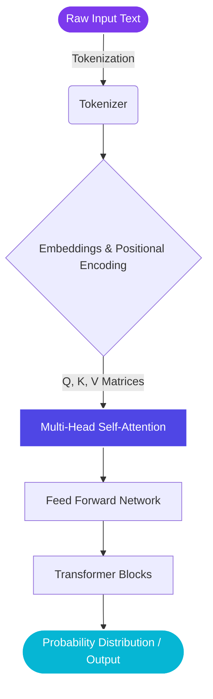

<div align="center">


<pre>
███████╗███████╗██████╗ ██████╗  █████╗
██╔════╝██╔════╝██╔══██╗██╔══██╗██╔══██╗
███████╗█████╗  ██████╔╝██████╔╝███████║
╚════██║██╔══╝  ██╔══██╗██╔══██╗██╔══██║
███████║███████╗██║  ██║██║  ██║██║  ██║
╚══════╝╚══════╝╚═╝  ╚═╝╚═╝  ╚═╝╚═╝  ╚═╝
</pre>


<br>

<a href="https://github.com/serratanis">
  
</a>

</div>

---

## 👋 About Me

I'm a **3rd-year Computer Engineering student at Marmara University**, passionate about understanding how systems work under the hood—from logic circuits to Large Language Models. 

I actively develop software and build AI solutions, constantly bridging the gap between theoretical computer science and practical applications. Recently, I've been focusing on **RAG frameworks and Chatbot systems** during my internship at **Adanet**, participating in data science challenges like the **Grid Up Datathon**, and maintaining active repositories for LLM development.

> **Learn → Build → Experiment → Improve**

---

## 📊 GitHub Stats

<div align="center">
  
  
</div>

---

## 🧠 Code Profile

```python
class Serra:

    def __init__(self):
        self.role = "Computer Engineering Student"
        self.university = "Marmara University"

    def get_focus_areas(self):
        return {
            "AI_&_ML": ["LLMs", "NLP", "RAG Systems", "Transformers"],
            "Software": ["Python", "Java", "Assembly", "C"],
            "Design_&_Hardware": ["Figma", "Digital Logic Design"]
        }

    def current_projects(self):
        return [
            "Building a Large Language Model from scratch",
            "Developing RAG frameworks for enterprise chatbots",
            "Competing in Datathons"
        ]

    def execute_philosophy(self):
        while True:
            learn()
            build()
```

---

## 🧬 My AI & Data Journey

*A simplified view of a Transformer architecture workflow I enjoy exploring:*



---

## ⚡ Tech Stack & Tools

<div align="center">

### Languages & Core Tech


### AI, ML & Data
<br><br>


### Development, Design & Hardware
<br><br>


</div>

---

## 🌐 Connect With Me

<div align="center">
<br>
<a href="https://github.com/serratanis">

</a>
<a href="https://www.linkedin.com/in/serra-tanis/">

</a>

<br><br>


</div>
